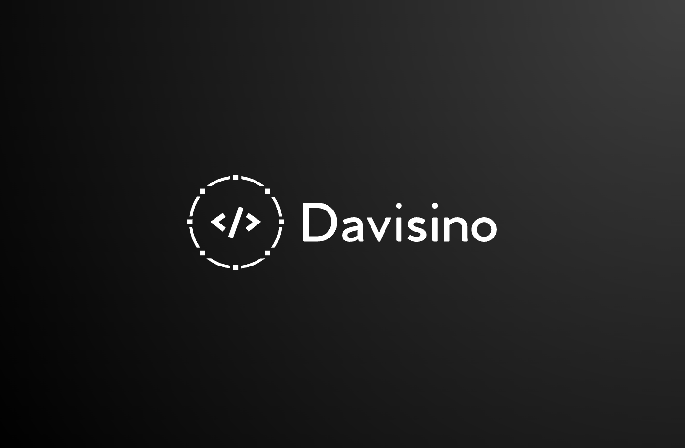
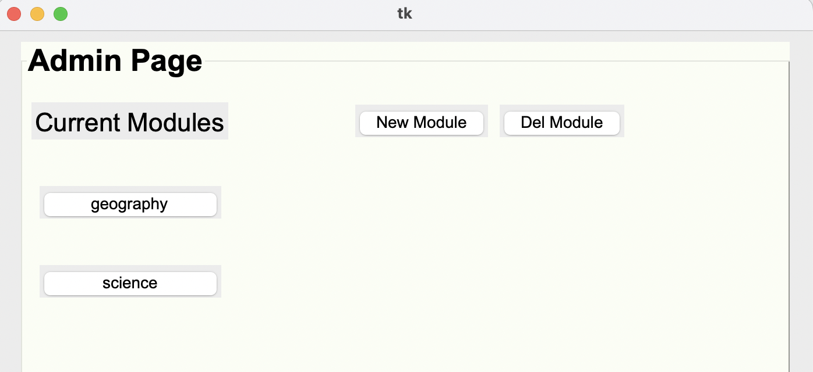

<div align="center" id="top"> 
  

&#xa0;

  <!-- <a href="https://project.netlify.app">Demo</a> -->
</div>

<h1 align="center">Quiz APP</h1>

<!-- Status -->

<!-- <h4 align="center">
	🚧  Project 🚀 Under construction...  🚧
</h4>

<hr> -->

<p align="center">
  <a href="#dart-about">About</a> &#xa0; | &#xa0; 
  <a href="#sparkles-features">Features</a> &#xa0; | &#xa0;
  <a href="#rocket-technologies">Technologies</a> &#xa0; | &#xa0;
  <a href="#white_check_mark-requirements">Requirements</a> &#xa0; | &#xa0;
  <a href="#checkered_flag-starting">Starting</a> &#xa0; | &#xa0;
  <a href="#memo-license">License</a> &#xa0; | &#xa0;
  <a href="https://github.com/{{YOUR_GITHUB_USERNAME}}" target="_blank">Author</a>
</p>

<br>

## :dart: About

The Quiz APP is built as part of a programming module. It uses some of the OOP properties.

Within the Quiz App you can create modules and questions for each of them. Later someone can choose from the list of modules and take a quiz on that module. This is project can be used by professors to improve students grade on the subject by allowing them to take as many quizzes as they need.

ALthough this project was part of a module, I enjoyed it a lot. Some of the features I implemented are registration/login authentication, Admin frontend features and SQL CRUD operations to add, delete, alter and get questions/modules.

On the user interface, the project is currently missing some features such as the "grade calculator" based on the amount of questions it took. A "print" function was also considered.

## :sparkles: Features

:heavy_check_mark: Admin Interface
Within the admin page you can add/delete new modules/questions.



:heavy_check_mark: User Interface

1

## 

2

Within the user page you can select a module and take the quiz. You will be prompted to answer all questions for each module.

## :rocket: Technologies

The following tools were used in this project:

- [Python](https://www.python.org/)
- [Tkinter](https://docs.python.org/3/library/tkinter.html)
- [Sqlite3](https://www.sqlite.org/index.html)

## :white_check_mark: Requirements

Before starting :checkered_flag:, you need to have [Git](https://git-scm.com) and [Python](https://www.python.org/) installed.

## :checkered_flag: Starting

```bash
# Clone this project
$ git clone https://github.com/Davisino/project/Quiz-Tkinter-

# Access
$ cd Quiz-Tkinter-


# Run the project
$ python3 App.py

```

## :memo: License

This project is under license from MIT. For more details, see the [LICENSE](LICENSE.md) file.

Made with :heart: by <a href="https://github.com/Davisino" target="_blank">Davisino</a>

&#xa0;

<a href="#top">Back to top</a>
